# CRUD de Videojuegos - Laravel Breeze

Este proyecto es una aplicación web desarrollada con **Laravel 12** y **Breeze** que permite gestionar un catálogo de videojuegos mediante un sistema CRUD (Create, Read, Update, Delete).

## Funcionalidades
- **Autenticación:** Registro e inicio de sesión de usuarios.
- **Gestión de Videojuegos:** - Listado de títulos con precio, stock y género.
  - Creación de nuevos registros con validación.
  - Edición completa de datos existentes.
  - Eliminación de registros de la base de datos.

## Instalación

1. Clonar el repositorio:
   ```bash
        git clone https://github.com/Makiflay86/DWES.git
    ```
    >**Nota:** Tienes que dirigirte a LARAVEL>CRUD-Breeze donde se encontarar este CRUD.

2. Instalar dependencias de PHP y JS:

    ```bash
        composer install
        npm install && npm run build
    ```

3. Configurar el archivo .env (Base de datos) y generar la clave:

    ```bash
        cp .env.example .env
        php artisan key:generate
    ```

4. Ejecutar las migraciones:

    ```bash
        php artisan migrate
    ```

5. Iniciar el servidor:

    ```bash
        php artisan serve
    ```

## Archivos Modificados y Creados

A continuación se detallan los componentes clave desarrollados para este CRUD:

1. **Base de Datos** (`database/migrations/`): Se creó la migración para la tabla `videojuegos` definiendo campos como `titulo`, `genero`, `precio`, `stock`, `fecha_lanzamiento` y `en_oferta`.

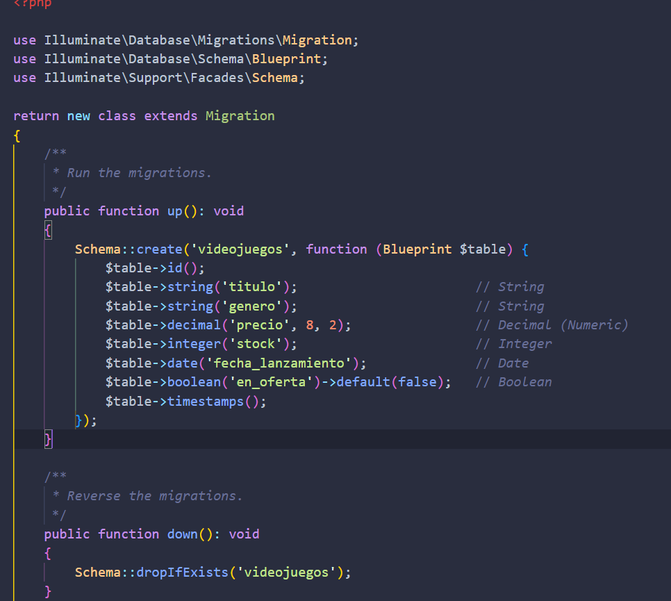


2. **Modelos** (`app/Models/Videojuego.php`): Se definió la propiedad `$fillable` para permitir la asignación masiva de datos desde los formularios.

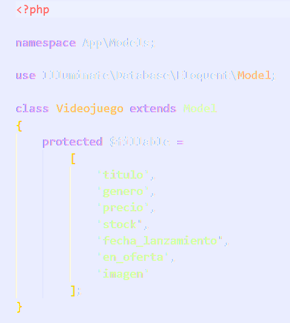


3. **Rutas** (`routes/web.php`): Se implementó `Route::resource('videojuegos', VideojuegoController::class)` protegida por el middleware de autenticación de Breeze.

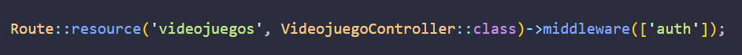


4. **Controlador** (`app/Http/Controllers/VideojuegoController.php`): Contiene la lógica para listar registros (`index`), mostrar formularios (`create/edit`), guardar cambios (`store/update`) y eliminar datos (`destroy`).

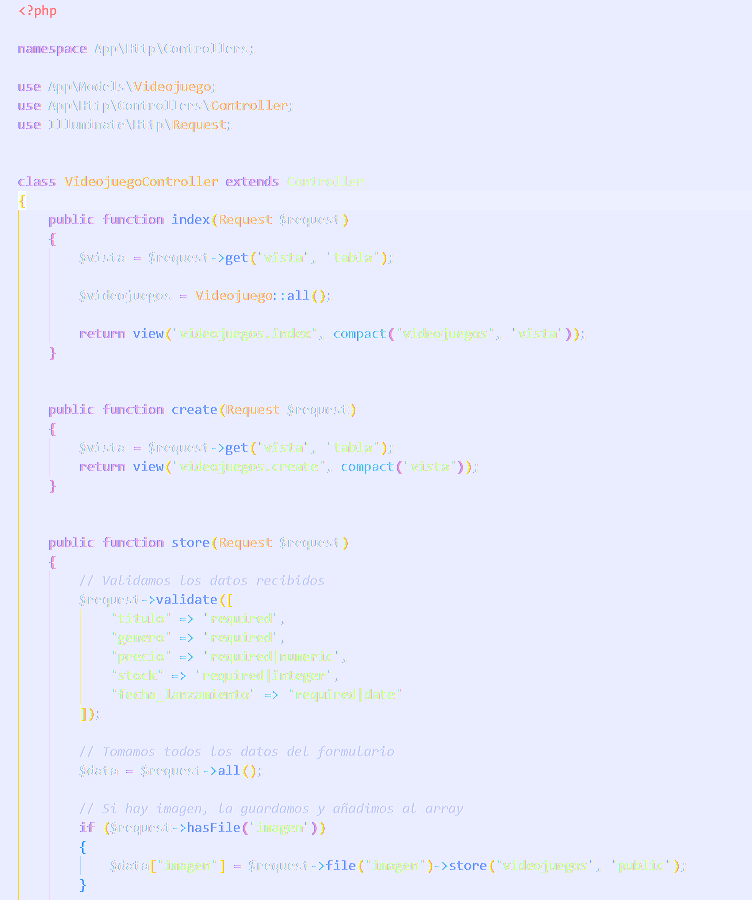
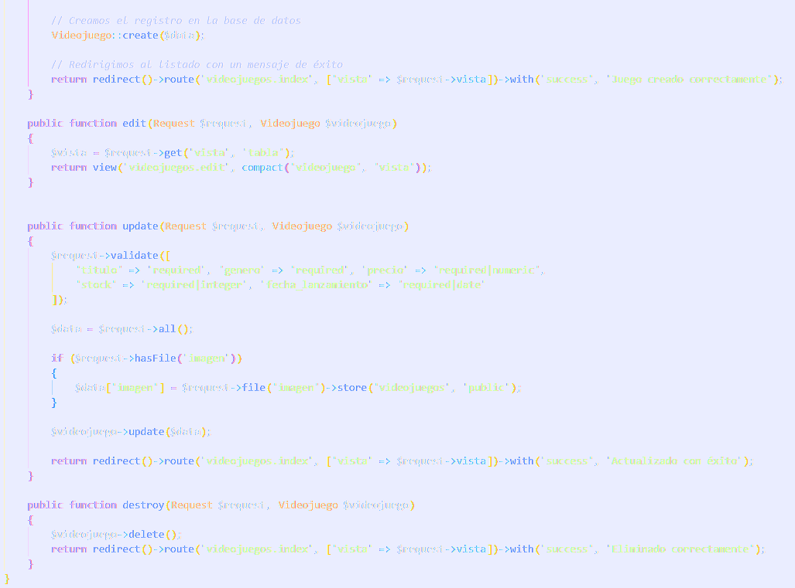


5. **Vistas** (`resources/views/videojuegos/`):

* `index.blade.php`: Tabla dinámica con acciones de gestión.

    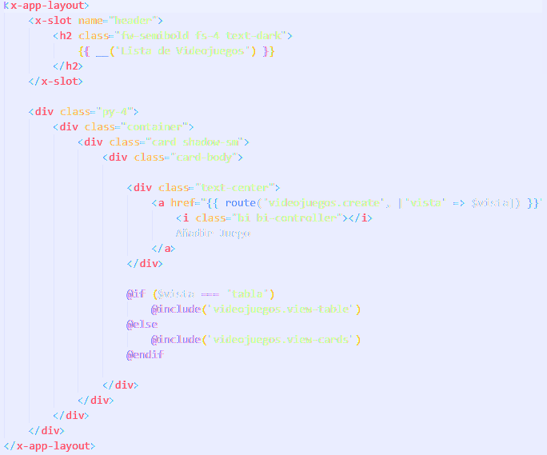
    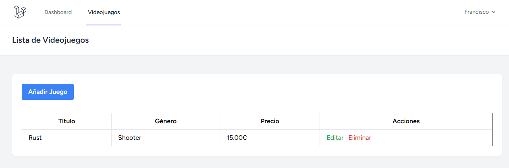


* `create.blade.php` y `edit.blade.php`: Formularios integrados con los componentes de diseño de Breeze.

    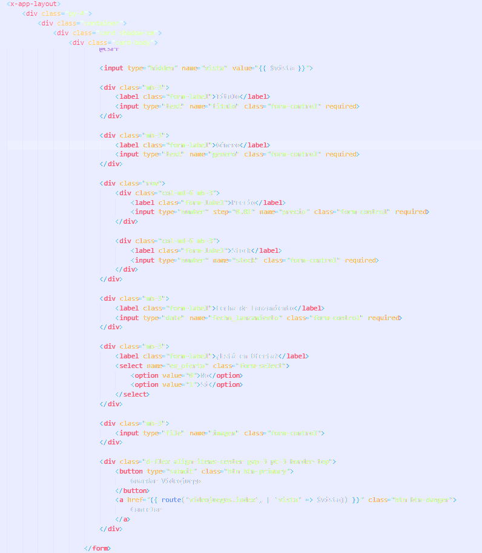
    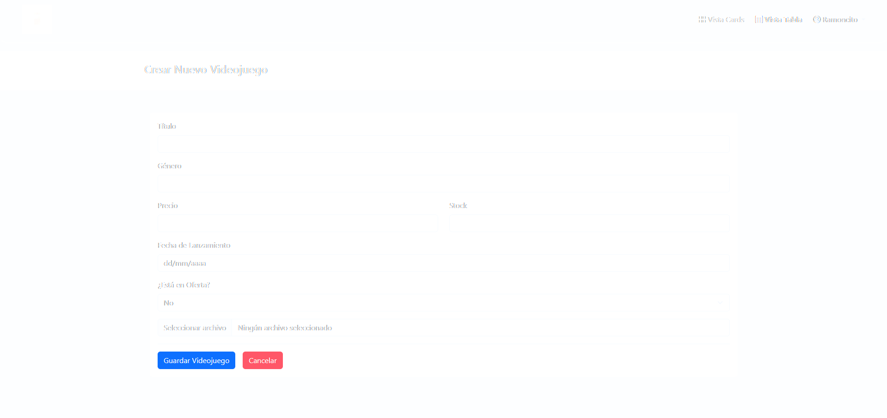

    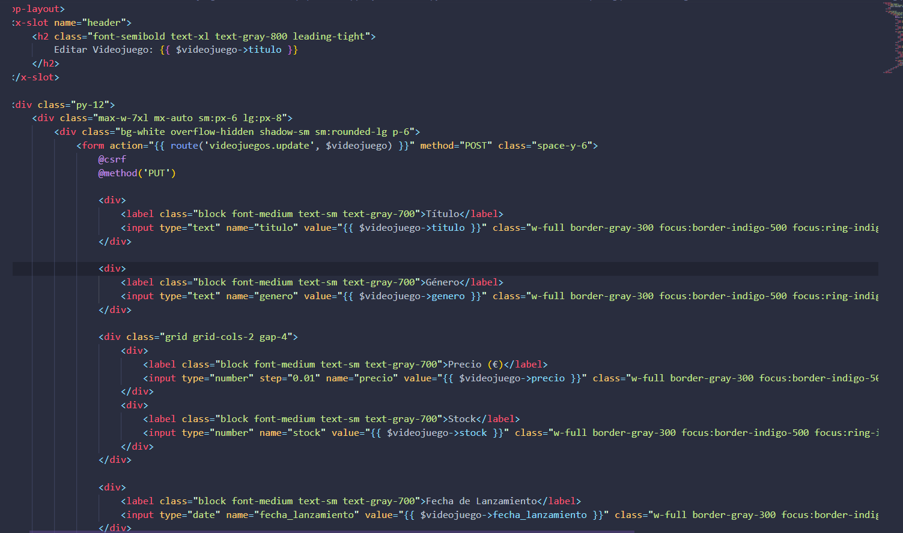
    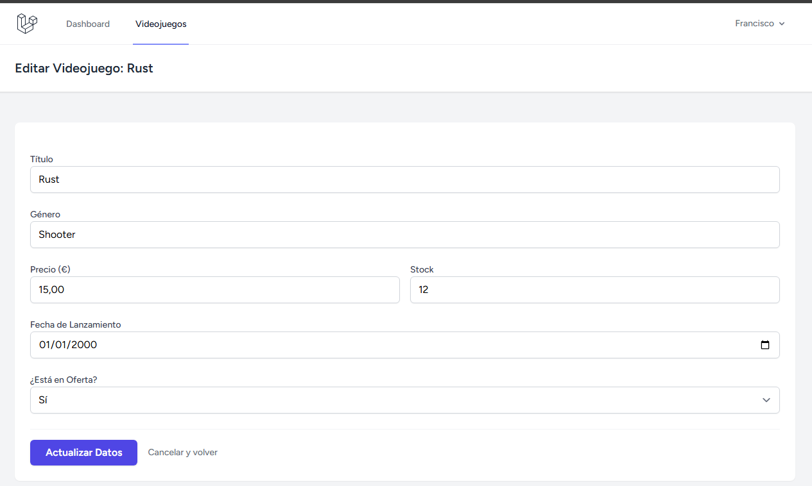


6. **Navegación** (`resources/views/layouts/navigation.blade.php`): Se añadió el enlace al CRUD para facilitar el acceso desde el Dashboard.

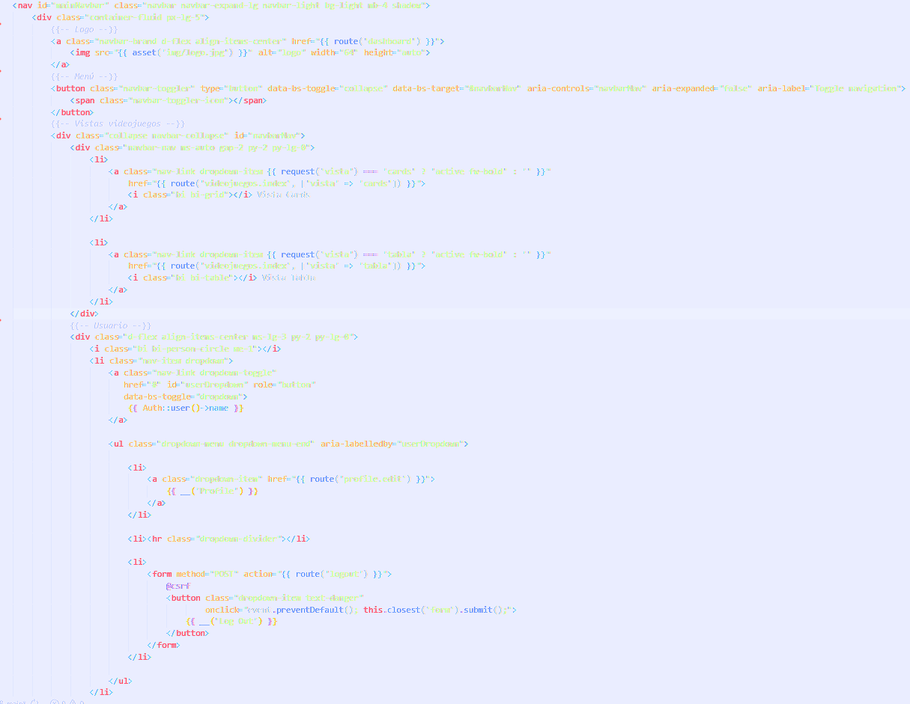


---
**Autor:** Francisco Aybar Romero