# API RESTful de Pokémon con Laravel Sanctum

Este proyecto implementa una API RESTful protegida utilizando **Laravel** y **Laravel Sanctum** para la autenticación basada en tokens. Permite gestionar una base de datos de Pokémon de forma segura, requiriendo autenticación para las operaciones de lectura y escritura.


## Requisitos Previos

Asegúrate de tener instalado lo siguiente:

*   **XAMPP** (o cualquier entorno con PHP y MySQL).
*   **Composer** (Gestor de dependencias de PHP).
*   **Postman** (Para probar los endpoints de la API).

---


## Tecnologías Utilizadas

*   **PHP 8.x**
*   **Laravel Framework**
*   **Laravel Sanctum** (Autenticación API)
*   **MySQL / MariaDB**


## Instalación y Configuración

Sigue estos pasos para poner en marcha el proyecto:

### 1. Configuración de Base de Datos
Crea una base de datos vacía llamada api_pokemon. El archivo .env es el corazón de la configuración en Laravel; aquí vinculamos el framework con el motor MySQL para que Eloquent (el ORM) pueda realizar las consultas.

```ini
DB_CONNECTION=mysql
DB_HOST=127.0.0.1
DB_PORT=3306
DB_DATABASE=api_pokemon
DB_USERNAME=root
DB_PASSWORD=
```

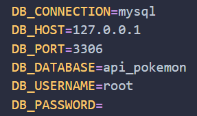


### 2. Definición del Esquema y Modelo de Datos
Ejecutamos `php artisan migrate`. Esto no solo crea la tabla `pokemons`, sino también la tabla `personal_access_tokens` necesaria para Sanctum.

**Explicación del Código en el Modelo** (`app/Models/Pokemon.php`): Hemos configurado el modelo para que sea compatible con nuestra tabla personalizada:

* `protected $table`: Forzamos el nombre de la tabla ya que Laravel busca por defecto el plural en inglés.

* `protected $fillable`: Definimos los 6 campos permitidos para la "asignación masiva", protegiendo la base de datos de inserciones maliciosas.

```php
protected $fillable = [
        'name', 
        'type', 
        'level', 
        'hp', 
        'is_legendary', 
        'captured'
    ];
```

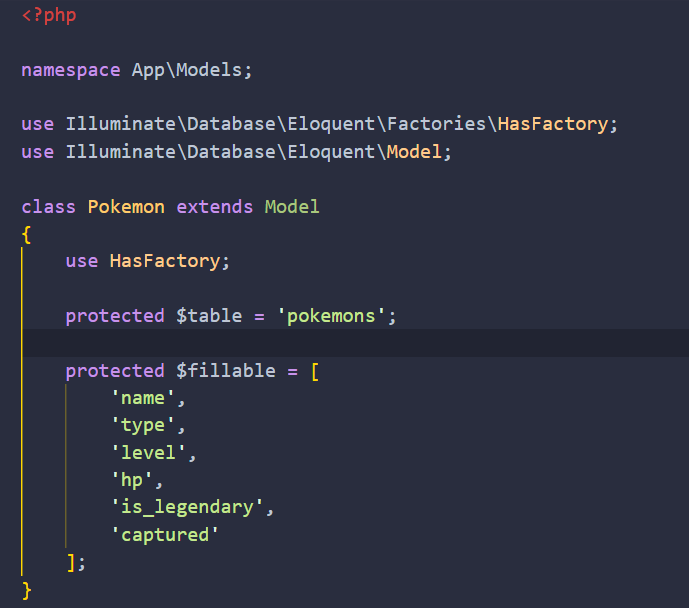


### 3. Lógica del Controlador (`PokemonController.php`)
El controlador gestiona las peticiones HTTP. Hemos implementado dos métodos clave:

* **index()**: Utiliza `Pokemon::all()` para recuperar todos los registros y devolverlos en formato JSON con un código de estado **200 OK**.

* **store()**: Recibe los datos de Postman a través del objeto `$request`, crea el registro en la BD y retorna el nuevo objeto con su ID y un código **201 Created**.

* **update()**: Localiza un Pokémon por su ID mediante `findOrFail()` y actualiza los campos recibidos.

* **destroy(**): Elimina permanentemente el registro tras validar su existencia.

```php
    public function store(Request $request) {
        $pokemon = Pokemon::create($request->all());
        return response()->json($pokemon, 201);
    }

    public function index() {
        return response()->json(Pokemon::all());
    }

    public function update(Request $request, $id) {
        $pokemon = Pokemon::findOrFail($id);
        $pokemon->update($request->all());
        return response()->json($pokemon, 200);
    }

    public function destroy($id) {
        Pokemon::destroy($id);
        return response()->json(['message' => 'Pokémon eliminado correctamente'], 200);
    }
```

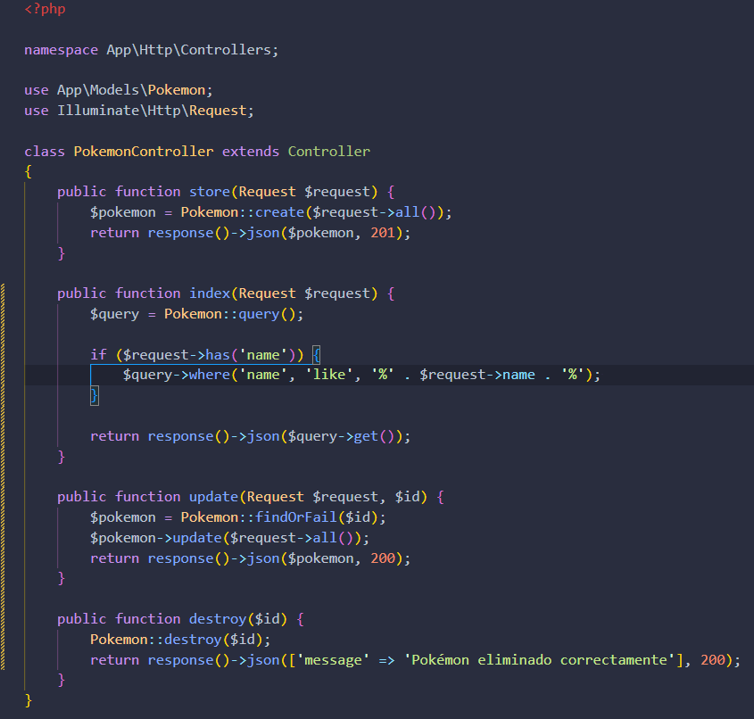


### 4. Protección de Rutas (Middleware Sanctum)
En el archivo `routes/api.php`, hemos envuelto nuestras rutas dentro de un grupo con el middleware `auth:sanctum`. Esto intercepta cualquier petición y verifica si el Bearer Token enviado en las cabeceras coincide con uno activo en la base de datos.

```php
    Route::middleware('auth:sanctum')->group(function () {
        Route::get('/pokemons', [PokemonController::class, 'index']);           // Listar
        Route::post('/pokemons', [PokemonController::class, 'store']);          // Guardar
        Route::put('/pokemons/{id}', [PokemonController::class, 'update']);     // Actualizar
        Route::delete('/pokemons/{id}', [PokemonController::class, 'destroy']); // Eliminar
    });
```

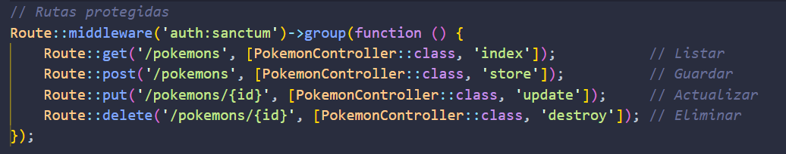


### 5. Estructura de la Base de Datos (Migración)
La tabla `pokemons` ha sido diseñada utilizando el Schema Builder de Laravel para garantizar la integridad de los datos. El archivo de migración en `database/migrations/` define los tipos de datos exactos que nuestra API manejará:

```php
    public function up(): void
    {
        Schema::create('pokemons', function (Blueprint $table) {
            $table->id();

            $table->string('name');
            $table->string('type');
            
            $table->integer('level')->default(1);
            $table->integer('hp');
            
            $table->boolean('is_legendary')->default(false);
            $table->boolean('captured')->default(true);
            
            $table->timestamps();
        });
    }
```

**Detalles técnicos de los campos:**

* **Booleano**: En la base de datos se almacena como `TINYINT(1)`, donde `1` es `true` y `0` es `false`.

* **Timestamps**: Laravel gestiona automáticamente la fecha de creación y actualización, lo que permite auditoría de datos.

* **Strings vs Integers**: Se han elegido tipos de datos óptimos para ahorrar espacio en disco y mejorar la velocidd de consulta.

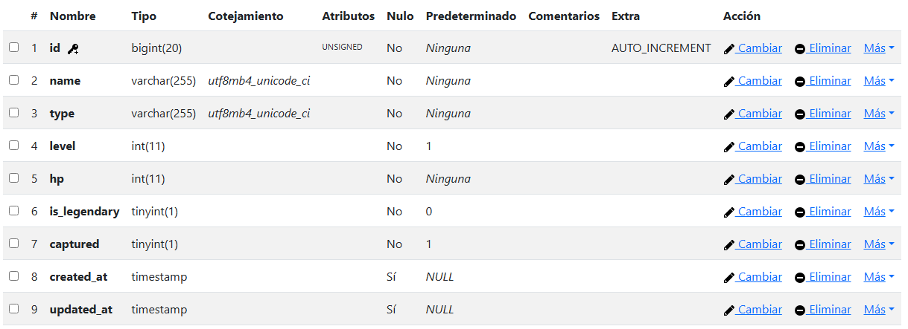

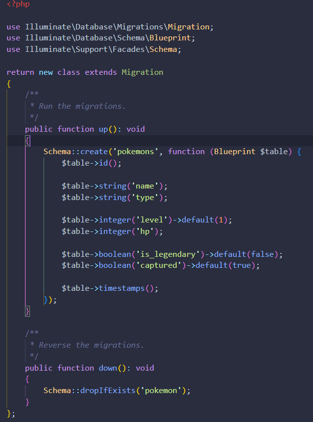


### 6. Gestión de Usuarios y Autenticación (Sanctum)
Para interactuar con la API de Pokémon, es obligatorio estar autenticado. Dado que no hemos implementado un registro público por seguridad, el acceso se gestiona de la siguiente manera:

**A. Creación del Usuario Administrativo**

Utilizamos **Laravel Tinker**, una herramienta de línea de comandos que nos permite interactuar directamente con la base de datos a través de Eloquent, para registrar al usuario que tendrá los permisos de acceso:

```bash
    php artisan tinker

    # Dentro de la consola de Tinker, ejecutamos:
    User::create([
        'name' => 'Admin',
        'email' => 'admin@admin.com',
        'password' => Hash::make('123456') // La contraseña se encripta por seguridad
    ]);
```

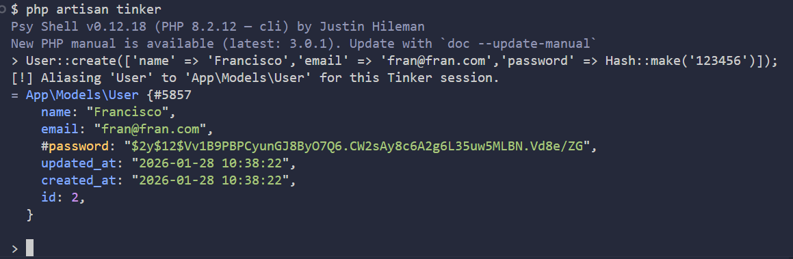

**B. Generación del Bearer Token (Login)**

Una vez creado el usuario, debemos "**pedir permiso**" al servidor para que nos dé una llave (Token). Esto se hace enviando una petición **POST** al endpoint `/api/login`.

**Lógica del Código en el Login**: El sistema verifica que el email exista y que la contraseña coincida con el hash almacenado. Si es correcto, Sanctum genera un token único que debe enviarse en la cabecera de cada petición posterior. Sin este token, cualquier intento de ver o crear un Pokémon será bloqueado por el servidor.

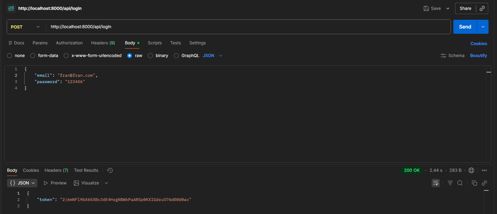


## Pruebas en Postman
**Paso 1: Obtener el Token (Login)** <br>
Realiza una petición POST a `/api/login` con el email y contraseña. El sistema te devolverá un `auth_token`.

> **Nota importante:** En la pestaña **Headers** de Postman, debes añadir la clave `Accept` con el valor `application/json`. Esto asegura que Laravel devuelva las respuestas (y los errores de validación) en formato JSON en lugar de intentar redirigir.


**Paso 2: Crear un Pokémon (POST)** <br>
Usa el token obtenido en la pestaña Authorization (Bearer Token) y envía un JSON en el Body con los campos: `name`, `type`, `level`, `hp`, `is_legendary` y `captured`.

> **Nota:** Recuerda configurar en los **Headers** la `Key: Accept` con `Value: application/json`. En la pestaña **Authorization**, selecciona **Bearer Token** y pega el token obtenido en el login del usuario anterior.


**Paso 3: Listar Pokémon (GET)** <br>
Realiza una petición GET a `/api/pokemons` con el token activo para ver todos los registros almacenados.

> **Nota:** Recuerda configurar en los **Headers** la `Key: Accept` con `Value: application/json` y en **Authorization** el token.


**Paso 4: Prueba de Seguridad** <br>
Si intentas acceder a las rutas sin el token, la API devolverá un error `401 Unauthorized`, confirmando que la protección de Sanctum funciona.


**Paso 5: Modificar un Pokémon (PUT)**

Para actualizar datos, usa el método PUT y añade el ID del Pokémon al final de la URL (ej. `/api/pokemons/1`). En el Body, selecciona raw/JSON y envía los campos a cambiar:

>**Nota**: Es obligatorio incluir el ID en la URL para que el controlador sepa qué registro editar.

```json
    {
        "level": 99
    }
```

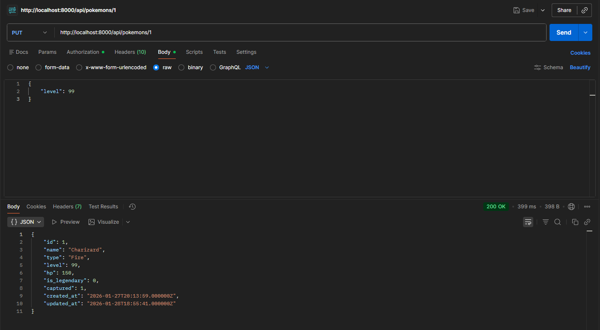

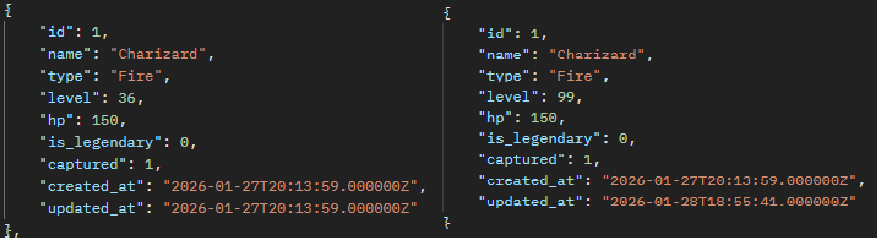


**Paso 6: Eliminar un Pokémon (DELETE)**

Usa el método DELETE hacia la URL con el ID (ej. `/api/pokemons/1`). 

> **Nota**: No necesitas enviar nada en el Body, solo el token en Authorization.

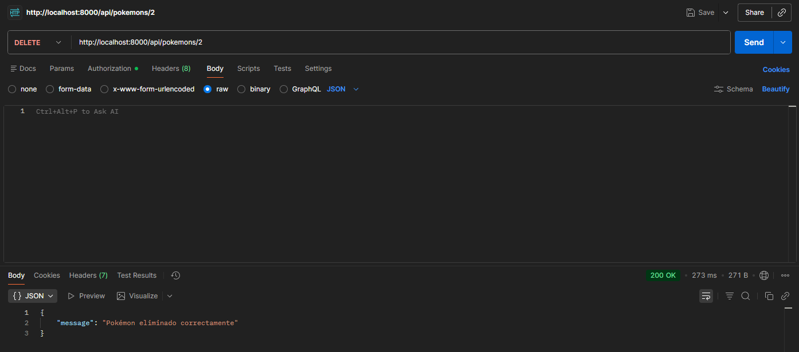
