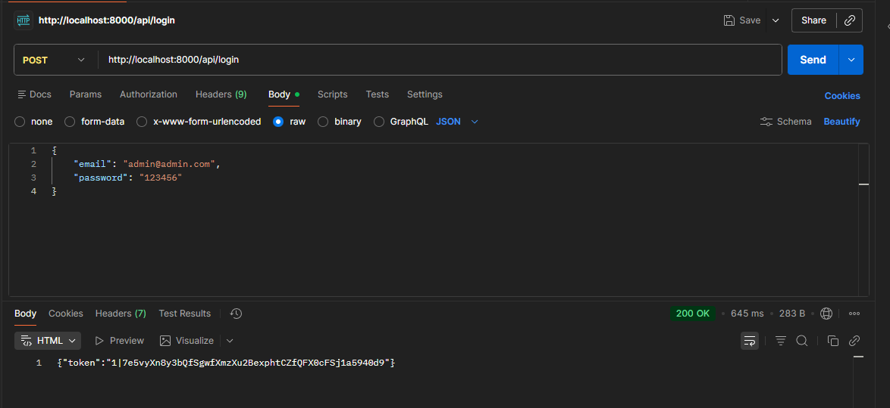
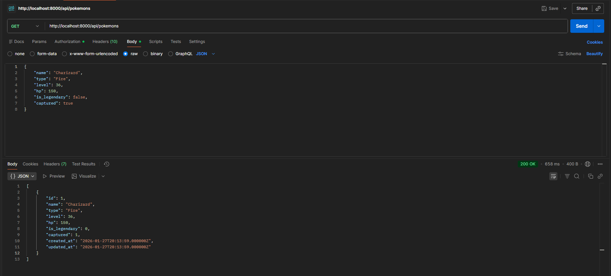
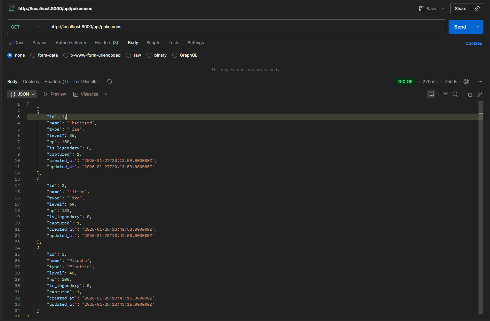
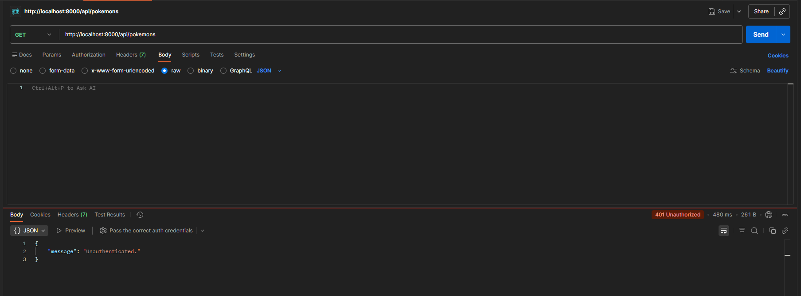

# API RESTful de Pokémon con Laravel Sanctum

Este proyecto implementa una API RESTful protegida utilizando **Laravel** y **Laravel Sanctum** para la autenticación basada en tokens. Permite gestionar una base de datos de Pokémon de forma segura, requiriendo autenticación para las operaciones de lectura y escritura.

## Requisitos Previos

Asegúrate de tener instalado lo siguiente:

*   **XAMPP** (o cualquier entorno con PHP y MySQL).
*   **Composer** (Gestor de dependencias de PHP).
*   **Postman** (Para probar los endpoints de la API).

---

## Tecnologías Utilizadas

*   **PHP 8.x**
*   **Laravel Framework**
*   **Laravel Sanctum** (Autenticación API)
*   **MySQL / MariaDB**

## Instalación y Configuración

Sigue estos pasos para poner en marcha el proyecto:

### 1. Configuración de Base de Datos

1.  Crea una base de datos vacía llamada `api_pokemon` en tu gestor (ej. phpMyAdmin).
2.  Configura tu archivo `.env` con las credenciales:

```ini
DB_CONNECTION=mysql
DB_HOST=127.0.0.1
DB_PORT=3306
DB_DATABASE=api_pokemon
DB_USERNAME=root
DB_PASSWORD=
```

## Pruebas en Postman
**Paso 1: Obtener el Token (Login)** <br>
Realiza una petición POST a `/api/login` con el email y contraseña. El sistema te devolverá un `auth_token`.

> **Nota importante:** En la pestaña **Headers** de Postman, debes añadir la clave `Accept` con el valor `application/json`. Esto asegura que Laravel devuelva las respuestas (y los errores de validación) en formato JSON en lugar de intentar redirigir.



**Paso 2: Crear un Pokémon (POST)** <br>
Usa el token obtenido en la pestaña Authorization (Bearer Token) y envía un JSON en el Body con los campos: `name`, `type`, `level`, `hp`, `is_legendary` y `captured`.

> **Nota:** Recuerda configurar en los **Headers** la `Key: Accept` con `Value: application/json`. En la pestaña **Authorization**, selecciona **Bearer Token** y pega el token obtenido en el login del usuario anterior.



**Paso 3: Listar Pokémon (GET)** <br>
Realiza una petición GET a `/api/pokemons` con el token activo para ver todos los registros almacenados.

> **Nota:** Recuerda configurar en los **Headers** la `Key: Accept` con `Value: application/json` y en **Authorization** el token. Para mostrar todos los pokémons **no tienes que poner nada en el Body**.



**Paso 4: Prueba de Seguridad** <br>
Si intentas acceder a las rutas sin el token, la API devolverá un error `401 Unauthorized`, confirmando que la protección de Sanctum funciona.

