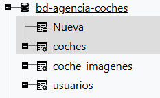
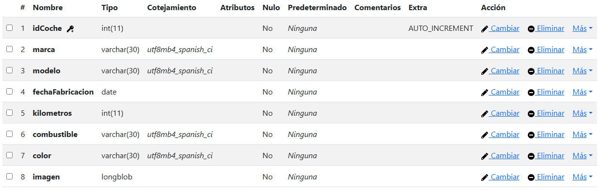
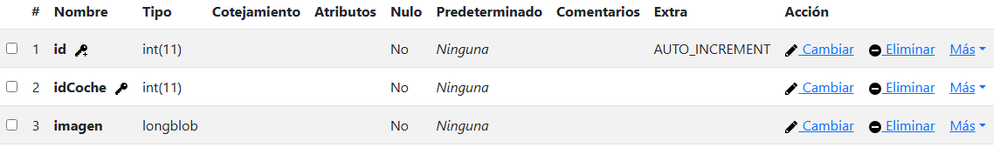
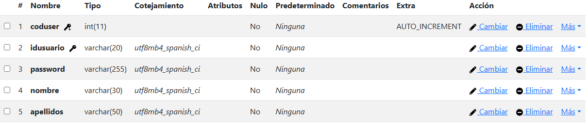
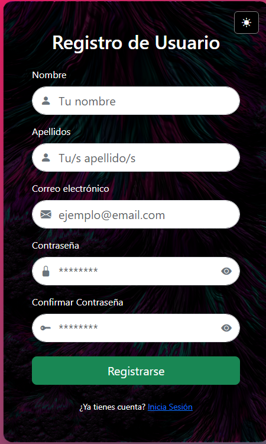
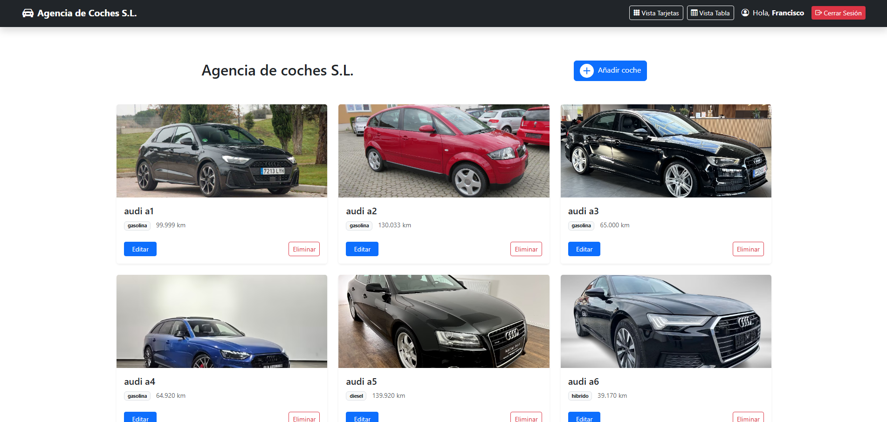
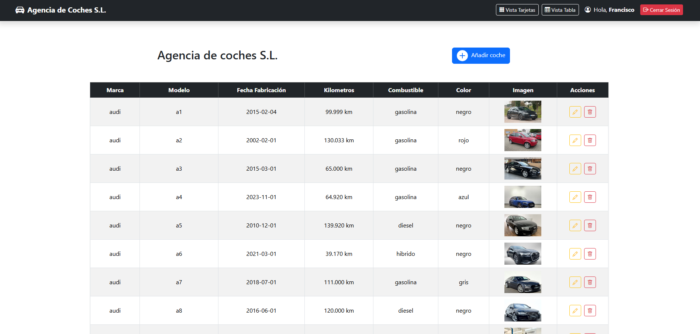
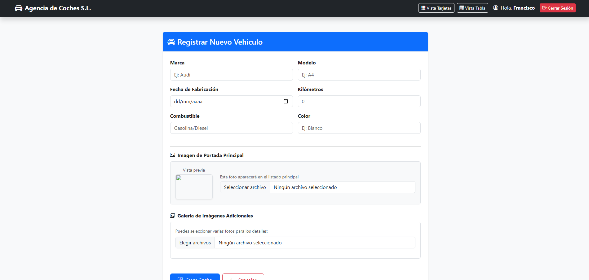
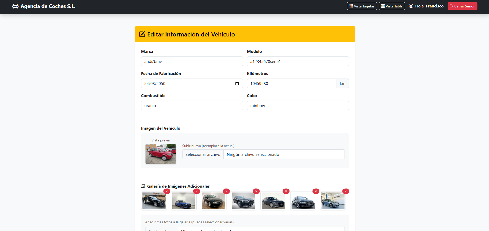

# Sistema de Gestión de Autenticación - Agencia S.L.

Este proyecto es una plataforma robusta de **Inicio de Sesión y Registro** desarrollada en **PHP Nativo**. Implementa una arquitectura de controlador centralizado y se enfoca en la seguridad del lado del servidor y una interfaz de usuario dinámica.

---

## Descripción del Proyecto
La aplicación gestiona el acceso de usuarios mediante un sistema de sesiones seguras. Utiliza **Bootstrap 5** para el diseño visual y **JavaScript nativo** para manejar la interactividad (cambio de secciones, validaciones y modo oscuro) sin necesidad de recargar la página constantemente.


---

## Tecnologías Utilizadas
* **Backend:** PHP 8.x (Lógica de sesiones, seguridad CSRF y control de acceso).
* **Frontend:** HTML5, CSS3, JavaScript.
* **Framework CSS:** Bootstrap 5.3.2 & Bootstrap Icons.
* **Seguridad:** OpenSSL para generación de tokens.

---

## Estructura y Función de los Archivos

### Core / Controlador
* **`index.php`**: Es el **Front Controller**. Centraliza todas las peticiones mediante el parámetro `action`. Decide si el usuario debe ser autenticado, registrado o redirigido a la zona interna.

### Vistas (`/views`)
* **`login.php`**: La interfaz principal. Contiene tanto el formulario de entrada como el de registro.
    * **Lógica de Bloqueo:** Impide el acceso si no se pasa por el controlador.
    * **SEO & Metadatos:** Configuración completa para buscadores y redes sociales (Open Graph).

### Scripts y Estilos (`/views/src`)
* **`js/validaciones.js`**: Validación en tiempo real de correos y contraseñas.
* **`js/show-section.js`**: Alterna la visibilidad entre el Login y el Registro mediante manipulación del DOM.
* **`js/dark-mode.js`**: Gestiona el cambio de tema visual y la persistencia.
* **`css/style-login.css`**: Estilos específicos para la tarjeta de acceso y animaciones.

---

## Inserciones de Código Importantes

### 1. Protección contra Acceso Directo
Este fragmento asegura que nadie pueda saltarse el controlador principal:
```php
if (!defined('BASE_URL')) {
    $_SESSION['error'] = "Acceso directo no permitido.";
    header("Location: ../index.php?action=login");
    exit();
}
```

### 2. Protección contra Acceso Directo
Para evitar ataques de falsificación de peticiones, generamos un token único por sesión:
```php
if (empty($_SESSION['csrf_token'])) {
    $_SESSION['csrf_token'] = bin2hex(openssl_random_pseudo_bytes(64));
}
```

### 3. Cambio Dinámico de Secciones (JS)
El sistema permite cambiar entre formularios sin refrescar el navegador:
```php
function showSection(sectionId) {
    document.getElementById('login-section').style.display = 'none';
    document.getElementById('register-section').style.display = 'none';
    document.getElementById(sectionId).style.display = 'block';
}
```

## Instalación y Configuración
* Servidor Local: Coloca el proyecto en tu carpeta de servidor (ej: htdocs o www).

* Base de Datos: Crea una base de datos e importa la tabla de usuarios (se requiere un campo email y password con hash).

* Configuración: Define la constante BASE_URL en tu archivo de inicio para que las rutas coincidan con tu entorno local.

* Acceso: Navega a http://localhost/tu-proyecto/index.php o http://localhost/DWES/PROYECTO/agencia-coches/index.php (si copias el repositorio).

## Estructura de la Base de Datos

Para que el sistema funcione correctamente con los formularios actuales, se recomienda la siguiente estructura en la tabla `usuarios`:

| Columna | Tipo | Descripción | Input Relacionado |
| :--- | :--- | :--- | :--- |
| **id** | INT (AI) | Clave primaria autoincremental. | - |
| **nombre** | VARCHAR(50) | Nombre del usuario. | `register_name` |
| **apellidos** | VARCHAR(100) | Apellidos del usuario. | `register_apellidos` |
| **email** | VARCHAR(100) | Correo único (usado para login). | `login_email` / `register_email` |
| **password** | VARCHAR(255) | Hash de la contraseña (usar `password_hash`). | `login_password` / `register_password` |

---

### Capturas de la Base de Datos

Para verificar la correcta instalación, la estructura en phpMyAdmin debe verse de la siguiente manera:


> *Vista general de la estructura de la bd.*


> *Vista general de la estructura de los coches.*


> *Vista general de la estructura de las imagenes de los coches.*


> *Vista general de la estructura de los usuarios.*

---

## Funcionamiento de la Aplicación

El flujo visual de la aplicación se divide en tres estados principales manejados por el controlador y JavaScript:


1. **Estado de Login (Default):** Muestra el `form1`. Verifica las credenciales contra la base de datos usando `password_verify()`.
2. **Estado de Registro:** Al pulsar el enlace, JS oculta el login y muestra el `form2`. El controlador valida que el email no esté duplicado.
3. **Estado de Sesión Activa:** Si el usuario intenta volver al login estando logueado, PHP detecta la variable `$_SESSION['usuario_logueado']` y lo redirige automáticamente al index interno.


---

### Arquitectura del Controlador Central (`index.php`)

El archivo `index.php` actúa como el **Front Controller** (Controlador Frontal) de la aplicación. Su función principal es interceptar todas las peticiones del usuario, gestionar la seguridad de la sesión y derivar el flujo de trabajo al controlador y método correspondientes.

#### Funcionamiento Interno:

1.  **Carga de Dependencias:** Mediante `require_once`, el sistema importa la configuración global (`config.php`), el modelo de datos (`Usuario.php`) y asegura la persistencia mediante `establecer-sesion.php` (donde reside el inicio de la sesión de PHP).
2.  **Enrutamiento Dinámico:** Utiliza la variable `$action` (capturada vía `$_REQUEST`) para determinar qué operación desea realizar el usuario. Si no se especifica ninguna, el sistema carga por defecto la vista de `login`.
3.  **Seguridad por Capas:** El controlador divide las rutas en dos bloques principales:
    * **Rutas Públicas:** Accesibles solo para usuarios no identificados (Login, Registro y Autenticación).
    * **Rutas Privadas (Protegidas):** Accesibles únicamente si existe la variable de sesión `usuario_logueado`. Cualquier intento de acceso a estas rutas sin estar autenticado redirigirá al usuario al formulario de acceso.


#### Bloque de Control de Rutas:

```php
// Ejemplo del sistema de enrutamiento según el estado de autenticación
if (!$isLoggedIn) 
{
    // Solo acciones de entrada
    switch ($action) 
    {
        case 'authenticate': 
            $auth->authenticate(); 
            break;
        case 'register':     
            $auth->register(); 
            break;
        default:             
            $auth->login(); 
            break;
    }
} else 
{
    // Gestión del CRUD de Coches y Logout
    switch ($action) 
    {
        case 'create':       
            $coche->create(); 
            break;
        case 'edit':         
            $coche->edit(); 
            break;
        case 'logout':       
            $auth->logout(); break;
        default:             
            $coche->index(); 
            break;
    }
}
```

## Guía Visual de la Aplicación

A continuación se detalla la interfaz del sistema y las funcionalidades disponibles en cada módulo.

### 1. Acceso y Registro (Vistas Dinámicas)
La aplicación utiliza una sola vista para el acceso, alternando entre formularios mediante manipulación del DOM con JavaScript.

* **Login:** Formulario principal con validación de credenciales y protección CSRF.
* **Sign-Up:** Formulario de registro con validaciones en tiempo real para asegurar que el usuario introduce datos válidos.




> *Captura: Vista del formulario de login y de sign-up.*

---

### 2. Dashboard de Gestión (Vista de Coches)
Una vez autenticado, el usuario accede al panel principal. Este panel permite visualizar la flota de vehículos de dos formas distintas:

* **Vista de Tabla:** Ideal para una administración rápida, mostrando columnas con marca, modelo, precio y acciones de edición/borrado.
* **Vista de Cards:** Una presentación más visual y comercial, enfocada en las imágenes del vehículo y sus características principales.





> *Captura: Panel de control mostrando el inventario en formato de tarjetas y tabla responsiva.*

---

### 3. Operaciones CRUD (Crear, Editar y Eliminar)
El `CocheController` gestiona la lógica de estas pantallas para asegurar la persistencia de los datos.

* **Crear Coche:** Formulario completo para registrar marca, modelo, año, precio y subir la galería de imágenes inicial.
* **Editar Coche:** Permite modificar datos existentes y gestionar la galería (añadir nuevas fotos o eliminar imágenes específicas a través de `getGaleriaJson`).
* **Eliminar:** Sistema de confirmación para eliminar registros de la base de datos de forma segura.






> *Captura: Formulario de edición, creación y la galería fotográfica del vehículo.*

---

Desarrollado por: Francisco Aybar Romero

GitHub: [makiflay86](https://github.com/Makiflay86)