<h1 align="center" style="font-size: 50px;">Sistema de Login MVC</h1>

<p align="center">
  
  
  
</p>


Este proyecto es una implementación de un sistema de autenticación de usuarios utilizando el patrón de diseño **Modelo-Vista-Controlador (MVC)** en PHP. El objetivo es separar la lógica de negocio de la interfaz de usuario para crear un código más limpio y mantenible.


## Requisitos e Instalación

Para ejecutar este proyecto en tu máquina local, sigue estos pasos:

1.  **Entorno de Servidor:** Debes tener instalado **XAMPP**, Laragon o cualquier servidor que soporte PHP y MySQL.


2.  **Clonar el Repositorio:**
    ```bash
    git clone https://github.com/Makiflay86/DWES.git
    ```


3. **Ubicación del Proyecto:**
    Este proyecto no se encuentra en la raíz del repositorio. Si has clonado el repositorio completo, lo encontrarás en:
    `DWES/PROYECTO/login-mvc`


4.  **Base de Datos:**
    * Abre **phpMyAdmin**.
    * Crea una nueva base de datos con el nombre `login-php`.
    * Importa el archivo `login-php.sql` que se encuentra en la raíz del proyecto para crear las tablas necesarias.


5.  **Configuración:**
    * Dirígete a `config/Database.php` y asegúrate de que los parámetros de conexión (host, dbname, usuario y contraseña) coincidan con tu configuración local.


## Estructura del Proyecto

La organización de los archivos sigue la arquitectura MVC y separa claramente los recursos estáticos de la lógica del servidor:

```text
login-mvc/
├── index.php                      # Front Controller / Router
│
├── config/                        # Configuración
│   ├── Database.php               # Conexión a la base de datos (PDO)
│   ├── config.php                 # La ruta raíz para los estilos y redirecciones
│   └── establecer-sesion.php      # Funciones de seguridad
│
├── controllers/                   # Controladores
│   └── AuthController.php         # Controlador de autenticación
│
├── models/                        # Modelos
│   └── Usuario.php                # Modelo de usuarios
│
├── views/                         # Vistas
│   ├── login.php                  # Formulario de login y sign-up
│   ├── dashboard.php              # Página de bienvenida
│   ├── css/
│   │   └── style.css              # Estilos personalizados
│   ├── js/
│   │   ├── dark-mode.js           # Modo oscuro
│   │   ├── show-section.js        # Alternar entre login y sign-up
│   │   ├── toggle-password.js     # Alternar en ver o no ver la password
│   │   └── validaciones.js        # Validar el formulario
│   └── img/                       
│       ├── favicon.ico            # Imagenes decorativas
│       └── favicon2.ico             
│
├── login-php.sql                  # Script SQL para crear la BD
│
├── img-readme/                    # Capturas para README
│   ├── vista-alertas.png
│   └── ...
│
└── README.md                      # Este archivo
```


## Explicación del Código

### Front Controller (`index.php`)

Es la puerta de entrada única al sistema que orquesta el flujo MVC y asegura la carga de dependencias críticas antes de cualquier ejecución.

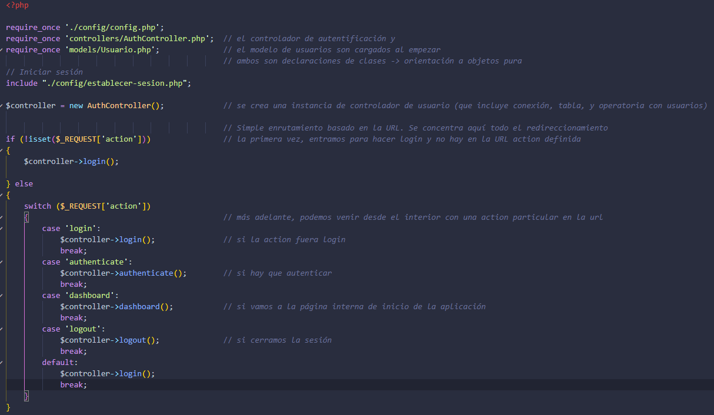
---


### Configuración y Seguridad Centralizada (`config/`)

Esta carpeta constituye el núcleo técnico del sistema, gestionando la portabilidad, la persistencia de datos y la protección proactiva de la sesión antes de entrar al flujo MVC.

#### 1. Portabilidad y Rutas (`config.php`)
Define la constante global `BASE_URL`. Esto es crítico para el patrón MVC, ya que permite que todas las redirecciones y las rutas de los archivos CSS/JS sean dinámicas, evitando errores de carga al mover el proyecto entre diferentes directorios del servidor.

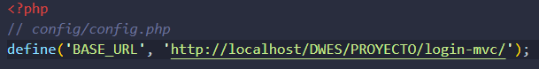
---

#### 2. Persistencia con PDO (`Database.php`)
Gestiona la comunicación con la base de datos mediante una clase orientada a objetos.
* **Seguridad:** Utiliza **PDO** con bloques `try-catch` para capturar excepciones de conexión.
* **Robustez:** Activa `ERRMODE_EXCEPTION`, lo que garantiza que cualquier fallo en el SQL sea detectado durante el desarrollo sin exponer errores crudos al usuario final.

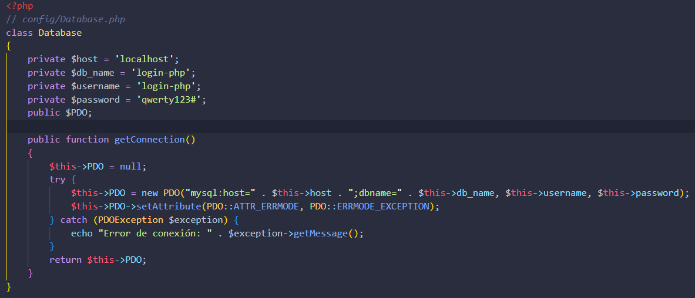
---

#### 3. Motor de Seguridad de Sesión (`establecer-sesion.php`)
Es el archivo encargado del "hardening" (endurecimiento) de la seguridad del sitio mediante tres capas:

* **Protección de Cookies:** Configura parámetros estrictos como `httponly` (bloquea el acceso a la sesión desde JavaScript) y `samesite => Strict` (defensa principal contra ataques CSRF).
* **Prevención de Session Hijacking:** Implementa una regeneración automática del ID de sesión cada 20 minutos (`1200s`) mediante `session_regenerate_id(true)`, invalidando cualquier identificador antiguo.
* **Generador de Token CSRF:** Crea un token criptográfico de 64 bytes altamente seguro utilizando `openssl_random_pseudo_bytes`, el cual es validado por el controlador en cada petición `POST`.

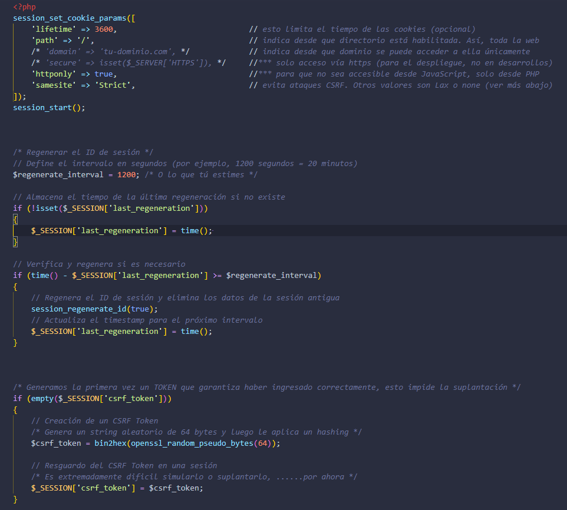
---


### Lógica del Controlador

El `AuthController.php` centraliza toda la inteligencia del sistema. A continuación, se detallan sus componentes de seguridad y control:

#### 1. Control de Intentos y Bloqueo (Anti-Fuerza Bruta)
El sistema monitoriza los fallos de inicio de sesión. Si un usuario falla más de 5 veces, se activa un "cooldown" de 5 minutos. El controlador calcula el tiempo restante y bloquea el acceso hasta que el tiempo expire, protegiendo el sistema de ataques automatizados.

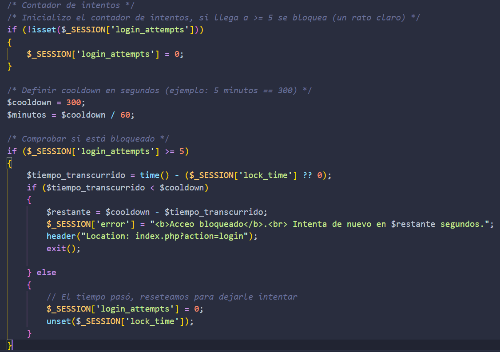
---

#### 2. Validación de Seguridad CSRF
Para cada petición de autenticación, el controlador compara el `csrf_token` enviado por el formulario con el almacenado en la sesión. Si no coinciden, la petición se aborta, evitando que atacantes externos realicen acciones en nombre del usuario.

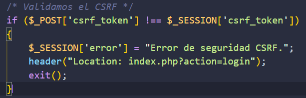
---

#### 3. Autenticación y Sanitización
Antes de consultar la base de datos, los datos recibidos mediante `POST` se limpian con `htmlspecialchars`. Una vez validados, se invoca al modelo para verificar las credenciales y, en caso de éxito, se inicializan las variables de sesión del usuario.

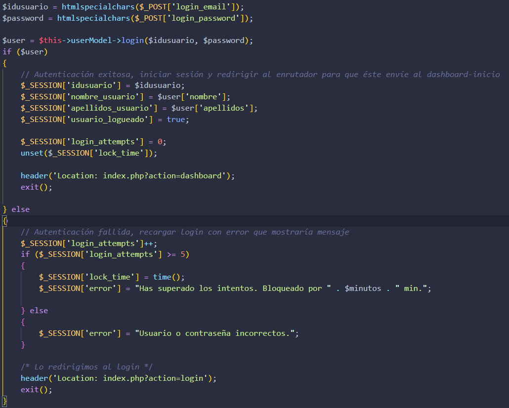
---

#### 4. Protección de Rutas (Middleware de Sesión)
Al invocar la función `dashboard()`, el controlador realiza una comprobación de seguridad inmediata: verifica si existe la variable de sesión `idusuario`. Si el usuario no está autenticado (la sesión no existe), el sistema bloquea el acceso y lo redirige automáticamente al formulario de login; en caso contrario, permite la carga de la vista privada. Esta lógica impide que cualquier persona acceda al panel de control simplemente escribiendo la URL en el navegador.

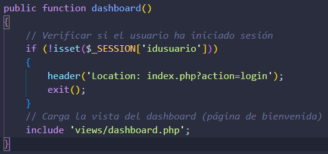
---

#### 5. Cierre de Sesión Seguro (Logout)
No solo destruye la sesión con `session_destroy()`. El código limpia las variables de sesión (`session_unset`) y elimina físicamente la cookie de sesión del navegador del usuario, garantizando que nadie pueda reutilizar la sesión anterior.

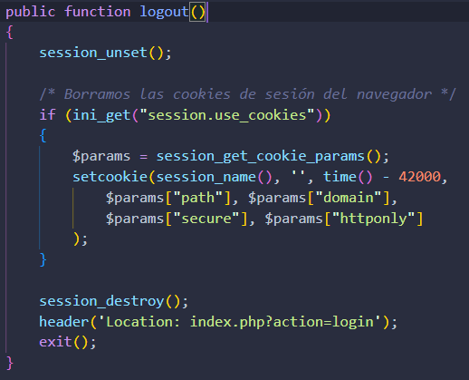
---


### Modelo de Datos (`Usuario.php`)

El modelo es el componente encargado de interactuar con la base de datos, abstrayendo la lógica de persistencia del resto de la aplicación.

#### 1. Conexión Mediante Inyección de Dependencias
Al instanciar la clase `Usuario`, su constructor invoca automáticamente a la clase `Database` para establecer una conexión segura a través de **PDO**. Esto garantiza que cada objeto de usuario tenga acceso a las herramientas necesarias para realizar consultas.

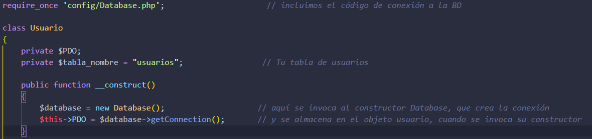
---

#### 2. Consultas Preparadas (Protección SQL Injection)
Para verificar las credenciales, el modelo utiliza **sentencias preparadas** (`prepare` y `execute`). Esta técnica es vital para la seguridad, ya que evita ataques de **Inyección SQL** al separar la estructura de la consulta de los datos proporcionados por el usuario.

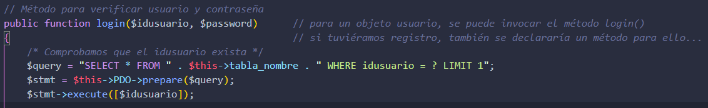
---

#### 3. Verificación Segura de Contraseñas (`password_verify`)
El sistema no almacena ni compara contraseñas en texto plano. En su lugar, recupera el hash almacenado en la base de datos y utiliza la función nativa `password_verify()` para comprobar si la contraseña introducida coincide con el hash, cumpliendo con los estándares modernos de seguridad.

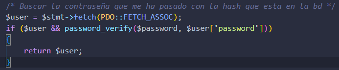
---


### Interfaz del Sistema

A continuación se muestra el resultado final de la interfaz de usuario, donde se combina la potencia de Bootstrap 5 con estilos personalizados y animaciones CSS.

#### 1. Formulario de Acceso (Login)
La vista de inicio incluye validaciones en tiempo real, alternancia de visibilidad de contraseña y soporte para modo oscuro.

<p align="center">
  <video src="https://raw.githubusercontent.com/Makiflay86/DWES/main/PROYECTO/login-mvc/img-readme/video-login.mp4" width="100%" controls autoplay loop muted>
    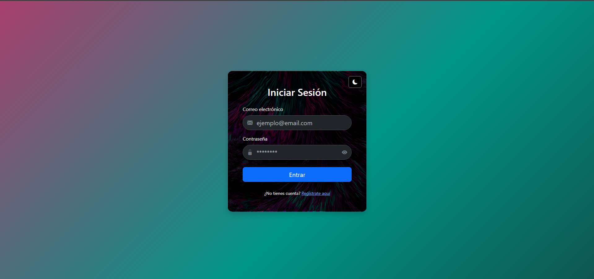
  </video>
</p>

#### 2. Panel de Control (Dashboard)
Una vez autenticado, el usuario accede a un panel privado que muestra sus datos personales y cuenta con una estética profesional mediante fondos animados.

<p align="center">
  <video src="https://raw.githubusercontent.com/Makiflay86/DWES/main/PROYECTO/login-mvc/img-readme/video-dashboard.mp4" width="100%" controls autoplay loop muted>
    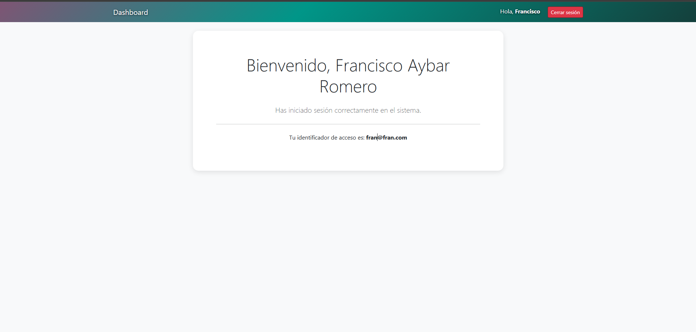
  </video>
</p>

---


### Interfaz de Usuario (`views/login.php`)

La vista de acceso ha sido diseñada con **Bootstrap 5**, priorizando la usabilidad y ofreciendo una experiencia moderna e interactiva.

#### 1. Sistema de Alertas Dinámicas
La vista utiliza sesiones de PHP para mostrar mensajes de error en tiempo real (como fallos de autenticación o bloqueos). Estas alertas se renderizan automáticamente y se eliminan de la sesión tras mostrarse para evitar repeticiones innecesarias.

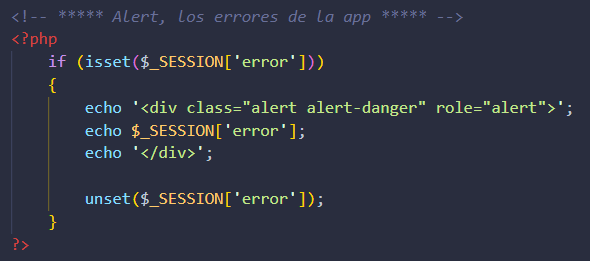
---

#### 2. Formulario Dual (Login/Registro)
Mediante manipulación del DOM con JavaScript, la vista permite alternar entre el formulario de inicio de sesión y el de registro sin recargar la página, mejorando la fluidez de la aplicación.

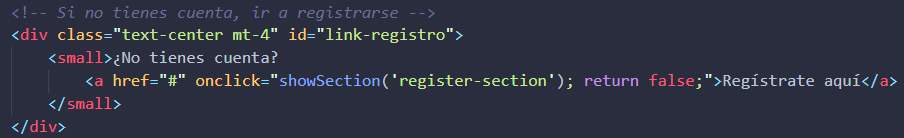
---

#### 3. Seguridad Visual: Ver Contraseña
Se ha implementado una funcionalidad que permite al usuario alternar la visibilidad de su contraseña mediante un icono de ojo. Esto reduce errores de escritura y mejora la accesibilidad del formulario.

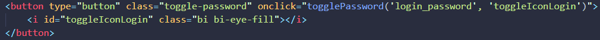
---

#### 4. Modo Oscuro (Dark Mode)
El sistema incluye un botón flotante para alternar entre temas claro y oscuro. Esta preferencia se gestiona mediante JavaScript, adaptando los colores de la tarjeta y el fondo para mayor comodidad visual.

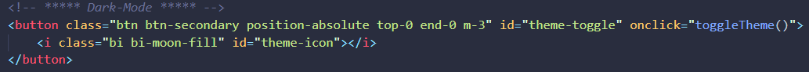
---

#### 5. Meta-Etiquetas y SEO
El archivo incluye una configuración exhaustiva de etiquetas `<meta>` para **Open Graph** y **Twitter Cards**, lo que permite que el enlace del proyecto se visualice con una tarjeta rica en información y favicon personalizado al ser compartido en redes sociales.

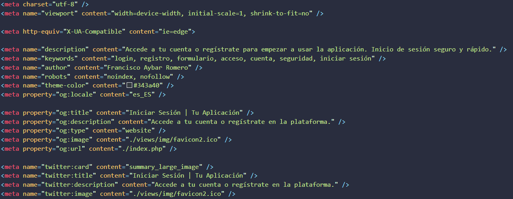
---

#### 6. Control de Acceso Preventivo (Redirección Automática)
Al inicio del archivo `login.php`, el código verifica inmediatamente si ya existe una sesión activa (`usuario_logueado`). Si es así, redirige al usuario al dashboard de forma automática, evitando que un usuario ya autenticado vuelva a ver el formulario de acceso innecesariamente.

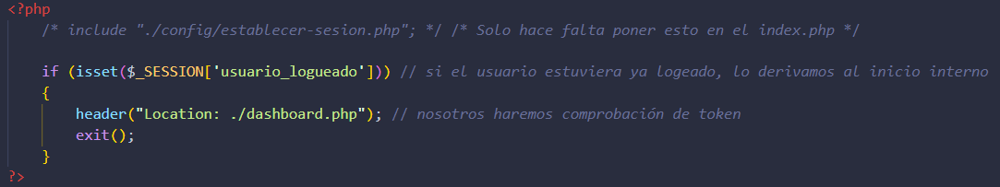
---

#### 7. Implementación de Token CSRF (Hidden Input)
Dentro de cada formulario (`form1` y `form2`), se incluye un campo de tipo `hidden` que inyecta el `csrf_token` generado en el servidor. Este token es invisible para el usuario pero fundamental para que el controlador valide que la petición es legítima y proviene de nuestro propio sitio, bloqueando cualquier intento de falsificación externa.

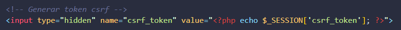
---


### Panel de Control (`views/dashboard.php`)

El dashboard es el área protegida del sistema. No es solo una interfaz visual, sino que actúa como una capa final de seguridad que verifica la integridad de la sesión antes de mostrar cualquier dato sensible.

#### 1. Triple Validación de Acceso
Antes de renderizar el HTML, el archivo ejecuta tres comprobaciones críticas:
* **Origen del Tráfico:** Verifica que la constante `BASE_URL` esté definida para asegurar que el usuario ha pasado por el `index.php` (Front Controller) y no está intentando cargar el archivo directamente.
* **Estado de Autenticación:** Comprueba la existencia de `usuario_logueado` en la sesión. Si no existe, redirige al login con un mensaje de error.
* **Integridad de Sesión (CSRF):** Valida que el `csrf_token` esté presente, garantizando que la sesión es legítima y no ha sido manipulada.

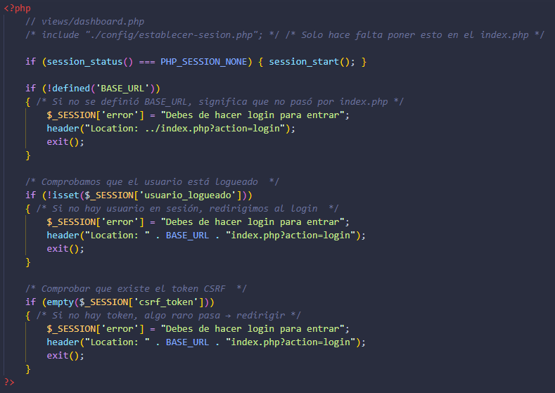
---

#### 2. Interfaz Dinámica y Experiencia de Usuario (UX)
Una vez superados los filtros de seguridad, la vista ofrece una experiencia personalizada mediante:
* **Visualización de Datos de Sesión:** Saluda al usuario utilizando su nombre y apellidos almacenados en las variables de sesión (`$_SESSION`), recuperadas previamente del modelo.
* **Diseño Responsivo con Bootstrap 5:** Utiliza una estructura de tarjetas (`cards`) y contenedores fluidos para adaptarse a cualquier dispositivo.
* **Estética Avanzada (CSS Animation):** Incluye una barra de navegación (`navbar-fondo`) con un degradado animado mediante `@keyframes`, lo que proporciona una estética moderna y profesional al panel de control.
* **Logout Seguro:** Proporciona un acceso directo al método de cierre de sesión, asegurando que el usuario pueda finalizar su actividad de forma inmediata y protegida.

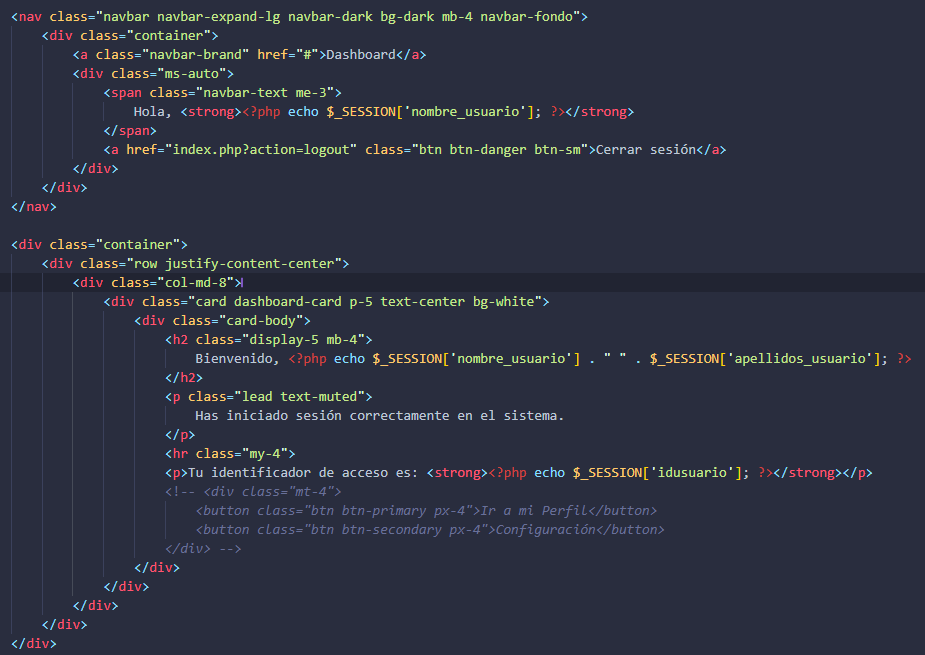


## Base de Datos y Persistencia (phpMyAdmin)

El proyecto utiliza **MariaDB** para la gestión de usuarios. A continuación se detalla la estructura lógica exacta de la tabla y los pasos para su despliegue.

### 1. Esquema de la Tabla `usuarios`
La tabla cuenta con una clave primaria autoincremental y campos optimizados para el almacenamiento de credenciales seguras.

| # | Nombre | Tipo | Atributos / Extra | Descripción |
| :--- | :--- | :--- | :--- | :--- |
| 1 | **id** | `int(11)` | PRIMARY KEY, AUTO_INCREMENT | Identificador numérico único. |
| 2 | **idusuario** | `varchar(60)` | INDEX | Nombre de usuario o correo de acceso. |
| 3 | **password** | `varchar(255)` | NOT NULL | Hash de la contraseña (longitud para BCRYPT). |
| 4 | **nombre** | `varchar(30)` | NOT NULL | Nombre de pila del usuario. |
| 5 | **apellidos** | `varchar(60)` | NOT NULL | Apellidos del usuario. |

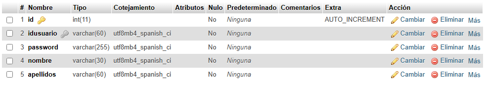
---

### 2. Proceso de Importación
Para configurar el entorno de datos correctamente en **XAMPP**:

1. **Crear DB:** Crea una base de datos llamada `login-php` con cotejamiento `utf8mb4_spanish_ci`.
2. **Importar:** Selecciona el archivo `login-php.sql` desde la pestaña **Importar**.
3. **Verificar:** Una vez finalizado, la tabla `usuarios` aparecerá con la estructura mostrada arriba.

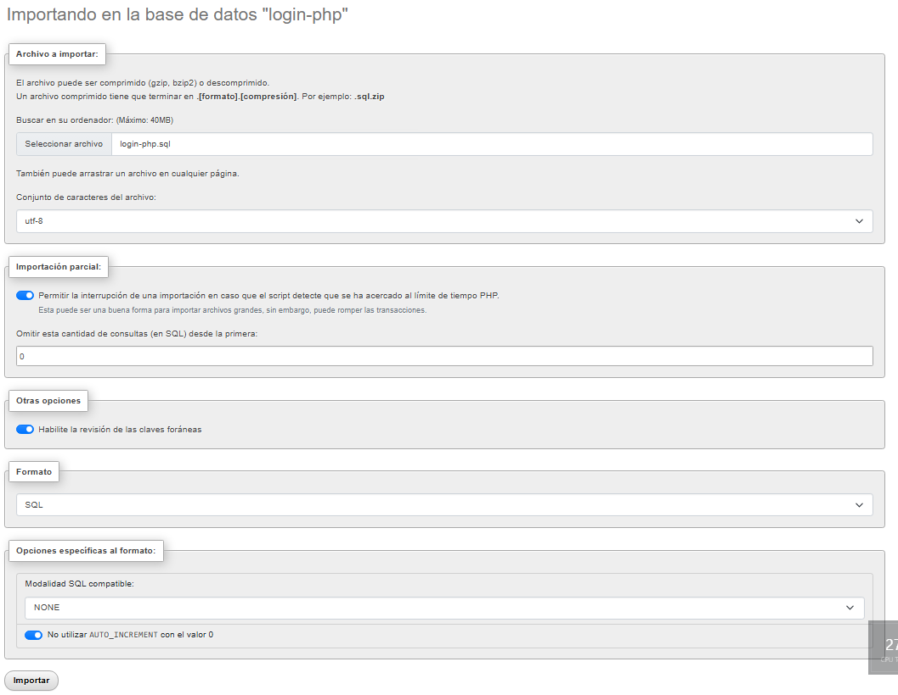
---

### 3. Usuarios de Prueba y Acceso

El archivo `login-php.sql` incluye la estructura necesaria y **dos usuarios preconfigurados** para validar el funcionamiento del sistema inmediatamente. Es importante destacar que el sistema utiliza el **correo electrónico** como identificador de acceso.

> **Nota de Seguridad:** Aunque la contraseña para las pruebas es `Contraseña123# o Password123#`, en la base de datos se almacenan mediante hashes de **BCRYPT**, lo que garantiza que las credenciales reales nunca sean visibles en texto plano dentro de las tablas.

| Correo (Login) | Contraseña |
| :--- | :--- |
| `fran@fran.com` | **Contraseña123#** |
| `aitor@aitor.com` | **Password123#** |

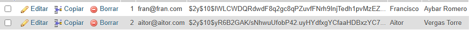


## Tecnologías y Referencias

Para garantizar la seguridad y eficiencia de este sistema, se han integrado las siguientes herramientas y estándares:

* **Lenguaje y Persistencia:** PHP 8.x utilizando la interfaz **PDO** (PHP Data Objects) para una comunicación segura con la base de datos.
* **Seguridad de Acceso:** Implementación de **BCRYPT** para el hash de contraseñas y validación de **CSRF Tokens** para prevenir ataques de falsificación.
* **Diseño y UI:** Interfaz construida con **Bootstrap 5.3** y **Bootstrap Icons** para asegurar un entorno responsivo y moderno.
* **Gestión de Sesiones:** Configuración de cookies seguras (`httponly` y `Samesite`) y regeneración de ID para mitigar el secuestro de sesiones.


## Solución de Problemas Comunes

Si encuentras dificultades al instalar o ejecutar el proyecto, revisa los siguientes puntos:

* **Error de Conexión (PDOException):** Verifica en `config/Database.php` que las credenciales coincidan con el usuario específico configurado en tu base de datos. En este entorno, por seguridad, no se utiliza el usuario `root`, sino un perfil con privilegios limitados exclusivamente a sentencias `SELECT`.
* **Base de Datos no encontrada:** Asegúrate de haber creado la base de datos con el nombre exacto `login-php` antes de importar el archivo `.sql`.
* **Error 404 en Estilos/Scripts:** Si el diseño no se ve bien, confirma que la constante `BASE_URL` en `config/config.php` apunte a la carpeta correcta donde clonaste el proyecto.
* **Sesión bloqueada:** Si el sistema te indica que estás bloqueado por intentos fallidos, espera 5 minutos o limpia las cookies de tu navegador para reiniciar el contador.


## Guía de Pruebas Rápidas

1. **Verificación de Datos:** Accede a phpMyAdmin y confirma que los usuarios de prueba aparecen con la contraseña cifrada (hash). Intenta loguearte con `fran@fran.com` y la clave `Contraseña123#`.
2. **Prueba de Fuerza Bruta:** Intenta loguearte con una contraseña errónea 5 veces seguidas para validar el bloqueo de seguridad.
3. **Prueba de Acceso Directo:** Intenta entrar a `views/dashboard.php` sin sesión activa para comprobar la redirección automática al login.
4. **Cierre de Sesión:** Tras pulsar "Cerrar Sesión", intenta volver atrás en el navegador; el sistema debe impedirte ver el dashboard nuevamente.so. Los usuarios deben ser dados de alta manualmente de forma directa en la base de datos.


## Uso
1. Inicia los servicios de Apache y MySQL en XAMPP.
2. Coloca la carpeta del proyecto en `htdocs`.
3. Abre tu navegador y navega a `http://localhost/DWES/PROYECTO/login-mvc/`.

---
Desarrollado por [Francisco Aybar Romero](https://github.com/Makiflay86)